# 🔊 Nova Sound — Base de Datos Unificada

Diagrama Entidad-Relación completo del sistema web de control de producción para **Nova Sound Manufacturing S.A. de C.V.**

---

## Leyenda

| Sección en el diagrama | Descripción | Tablas |
|:--|:--|:--|
| **GLOBALES** | Catálogos maestros compartidos por todas las áreas. Solo Sistemas los administra. | 10 |
| **SISTEMAS** | Tablas propias del área de Sistemas (auditoría, config, respaldos). | 3 |
| **PRODUCCIÓN** | Órdenes de trabajo y su historial de cambios. | 2 |
| **ENSAMBLE** | Registro de ensamble, objetivos por turno y defectos de línea. | 3 |
| **CALIDAD Y TRAZABILIDAD** | Pruebas funcionales, inspecciones, unidades (SSOT) e historial de auditoría. | 6 |
| **EMPAQUE** | Cajas, permisos y movimientos. | 3 |
| **ALMACÉN / EMBARQUES** | Pedidos, embarques, transportistas y trazabilidad de cajas. | 6 |
| | **Total** | **33** |

---

## Tablas por Área (Detalle)

### 🌐 GLOBALES — 10 tablas compartidas

| # | Tabla | Campos clave | Áreas que la usan |
|:--|:--|:--|:--|
| 1 | `roles` | id, nombre_rol | Todas |
| 2 | `usuarios` | id, nomina, nombre_completo, usuario_login, contrasena_hash, id_rol, activo | Todas |
| 3 | `modelos` | id, nombre_modelo, capacidad_caja | Producción, Ensamble, Almacén |
| 4 | `colores` | id, nombre_color | Producción, Almacén |
| 5 | `clientes` | id, nombre_cliente, tipo_cliente, permite_mezcla_colores, activo | Producción, Almacén |
| 6 | `lineas` | id, nombre_linea, activa | Producción, Calidad |
| 7 | `turnos` | id, nombre_turno, hora_inicio, hora_fin | Producción, Ensamble, Calidad |
| 8 | `cat_cajas` | id, tipo_caja, capacidad_maxima | Empaque, Almacén |
| 9 | `catalogo_defectos` | id, categoria, descripcion | Calidad, Ensamble |
| 10 | `catalogo_estados_calidad` | id, nombre_estado, permite_empaque | Calidad, Empaque |

---

### 🖥️ SISTEMAS — 3 tablas propias

| # | Tabla | Campos |
|:--|:--|:--|
| 1 | `parametros_sistema` | id, clave, valor, descripcion |
| 2 | `bitacora` | id, fecha, id_usuario, modulo, accion |
| 3 | `respaldos_log` | id, fecha_hora, id_usuario, exitoso |

---

### 🏭 PRODUCCIÓN — 2 tablas

| # | Tabla | Campos |
|:--|:--|:--|
| 1 | `ordenes` | id, folio, id_cliente, id_modelo, id_color, cantidad, fecha_compromiso, fecha_recepcion, id_usuario_registro, estado, id_linea_asignada, id_usuario_asigno, fecha_asignacion |
| 2 | `historial_ordenes` | id, id_orden, id_usuario, accion, estado_anterior, estado_nuevo, fecha_hora, comentario |

---

### 🔧 ENSAMBLE — 3 tablas

| # | Tabla | Campos |
|:--|:--|:--|
| 1 | `ensamble` | id, id_orden, id_modelo, id_turno, id_operador, cantidad, fecha_hora, id_usuario_registro |
| 2 | `objetivos` | id, id_modelo, id_turno, cantidad_objetivo |
| 3 | `defectos_ensamble` | id, id_pieza, motivo, etapa, id_usuario_registro, fecha_hora |

---

### 🔍 CALIDAD Y TRAZABILIDAD — 6 tablas

| # | Tabla | Campos |
|:--|:--|:--|
| 1 | `prueba_funcional` | id, id_orden, id_linea, id_usuario, id_turno, numero_serie, valida_encendido, valida_audio, valida_carga, valida_bluetooth, estado_prueba, fecha_hora |
| 2 | `defectos_funcionales` | id, id_prueba, id_usuario, tipo_falla, calidad, fecha_hora |
| 3 | `unidades` | id, id_orden, id_linea, id_turno, numero_serie, id_estado_calidad, id_caja, fecha_ensamble |
| 4 | `historial_unidades` | id, id_unidad, id_usuario, estado_anterior, estado_nuevo, motivo, fecha_hora |
| 5 | `inspecciones_calidad` | id, id_unidad, id_inspector, fecha_inspeccion, comentarios |
| 6 | `detalle_defectos_unidad` | id, id_inspeccion, id_defecto |

---

### 📦 EMPAQUE — 3 tablas

| # | Tabla | Campos |
|:--|:--|:--|
| 1 | `cajas` | id, fecha_creacion, fecha_cierre, estado, id_cat_caja, id_usuario_creador |
| 2 | `bitacora_permisos` | id, id_caja, id_usuario_autoriza, motivo, fecha_autorizacion |
| 3 | `historial_movimientos` | id, id_caja, evento, fecha, id_usuario |

---

### 🚚 ALMACÉN / EMBARQUES — 6 tablas

| # | Tabla | Campos |
|:--|:--|:--|
| 1 | `pedido` | id, folio, id_cliente, fecha_pedido, fecha_compromiso, estado |
| 2 | `pedido_detalle` | id, id_pedido, id_modelo, id_color, cantidad_solicitada |
| 3 | `embarque` | id, referencia_embarque, id_pedido, id_cliente, id_transportista, fecha_programada, fecha_salida, estado, observaciones, id_usuario_creo, id_usuario_confirmo, fecha_creacion |
| 4 | `transportista` | id, nombre, rfc, telefono, activo |
| 5 | `embarque_caja` | id, id_embarque, id_caja, fecha_asignacion, id_usuario_asigna, fecha_retiro, motivo_retiro |
| 6 | `embarque_historial` | id, id_embarque, operacion, estado_anterior, estado_nuevo, id_caja, id_usuario, fecha_hora, detalle |

---

## Diagrama E-R Global

```mermaid
erDiagram

    %% ╔══════════════════════════════════════════╗
    %% ║        GLOBALES (10 tablas)              ║
    %% ║  Catálogos maestros — Admin: Sistemas    ║
    %% ╚══════════════════════════════════════════╝

    roles ||--o{ usuarios : "asigna"

    roles {
        int id PK
        varchar nombre_rol
    }
    usuarios {
        int id PK
        varchar nomina UK
        varchar nombre_completo
        varchar usuario_login UK
        varchar contrasena_hash
        int id_rol FK
        boolean activo
    }
    modelos {
        int id PK
        varchar nombre_modelo UK
        int capacidad_caja
    }
    colores {
        int id PK
        varchar nombre_color
    }
    clientes {
        int id PK
        varchar nombre_cliente
        varchar tipo_cliente
        boolean permite_mezcla_colores
        boolean activo
    }
    lineas {
        int id PK
        varchar nombre_linea
        boolean activa
    }
    turnos {
        int id PK
        varchar nombre_turno
        time hora_inicio
        time hora_fin
    }
    cat_cajas {
        int id PK
        varchar tipo_caja
        int capacidad_maxima
    }
    catalogo_defectos {
        int id PK
        varchar categoria
        varchar descripcion
    }
    catalogo_estados_calidad {
        int id PK
        varchar nombre_estado
        boolean permite_empaque
    }

    %% ╔══════════════════════════════════════════╗
    %% ║        SISTEMAS (3 tablas)               ║
    %% ║  Auditoría, configuración y respaldos    ║
    %% ╚══════════════════════════════════════════╝

    usuarios ||--o{ bitacora : "genera"
    usuarios ||--o{ respaldos_log : "solicita"

    parametros_sistema {
        int id PK
        varchar clave UK
        int valor
        varchar descripcion
    }
    bitacora {
        int id PK
        datetime fecha
        int id_usuario FK
        varchar modulo
        varchar accion
    }
    respaldos_log {
        int id PK
        datetime fecha_hora
        int id_usuario FK
        boolean exitoso
    }

    %% ╔══════════════════════════════════════════╗
    %% ║        PRODUCCIÓN (2 tablas)             ║
    %% ║  Órdenes de trabajo y su historial       ║
    %% ╚══════════════════════════════════════════╝

    clientes ||--o{ ordenes : "solicita"
    modelos ||--o{ ordenes : "define_modelo"
    colores ||--o{ ordenes : "define_color"
    lineas ||--o{ ordenes : "asigna_linea"
    usuarios ||--o{ ordenes : "registra"
    ordenes ||--o{ historial_ordenes : "tiene_historial"
    usuarios ||--o{ historial_ordenes : "modifica"

    ordenes {
        int id PK
        varchar folio UK
        int id_cliente FK
        int id_modelo FK
        int id_color FK
        int cantidad
        date fecha_compromiso
        datetime fecha_recepcion
        int id_usuario_registro FK
        varchar estado
        int id_linea_asignada FK
        int id_usuario_asigno FK
        datetime fecha_asignacion
    }
    historial_ordenes {
        int id PK
        int id_orden FK
        int id_usuario FK
        varchar accion
        varchar estado_anterior
        varchar estado_nuevo
        datetime fecha_hora
        varchar comentario
    }

    %% ╔══════════════════════════════════════════╗
    %% ║        ENSAMBLE (3 tablas)               ║
    %% ║  Registro de ensamble y objetivos        ║
    %% ╚══════════════════════════════════════════╝

    ordenes ||--o{ ensamble : "se_ensambla"
    modelos ||--o{ ensamble : "modelo_ensamblado"
    turnos ||--o{ ensamble : "en_turno"
    usuarios ||--o{ ensamble : "opera"
    modelos ||--o{ objetivos : "meta_de"
    turnos ||--o{ objetivos : "por_turno"
    usuarios ||--o{ defectos_ensamble : "reporta"

    ensamble {
        int id PK
        int id_orden FK
        int id_modelo FK
        int id_turno FK
        int id_operador FK
        int cantidad
        datetime fecha_hora
        int id_usuario_registro FK
    }
    objetivos {
        int id PK
        int id_modelo FK
        int id_turno FK
        int cantidad_objetivo
    }
    defectos_ensamble {
        int id PK
        int id_pieza
        varchar motivo
        varchar etapa
        int id_usuario_registro FK
        datetime fecha_hora
    }

    %% ╔══════════════════════════════════════════╗
    %% ║   CALIDAD Y TRAZABILIDAD (6 tablas)      ║
    %% ║  Prueba funcional, inspección e historial ║
    %% ╚══════════════════════════════════════════╝

    ordenes ||--o{ prueba_funcional : "prueba"
    lineas ||--o{ prueba_funcional : "en_linea"
    turnos ||--o{ prueba_funcional : "en_turno"
    usuarios ||--o{ prueba_funcional : "inspecciona"
    prueba_funcional ||--o{ defectos_funcionales : "detecta"
    usuarios ||--o{ defectos_funcionales : "registra_falla"

    ordenes ||--o{ unidades : "genera_unidad"
    lineas ||--o{ unidades : "ensamblada_en"
    turnos ||--o{ unidades : "ensamblada_durante"
    catalogo_estados_calidad ||--o{ unidades : "estado"
    cajas ||--o{ unidades : "asignada_a"

    unidades ||--o{ inspecciones_calidad : "se_inspecciona"
    unidades ||--o{ historial_unidades : "audita_cambios"
    usuarios ||--o{ historial_unidades : "modifica_estado"
    usuarios ||--o{ inspecciones_calidad : "realiza"
    inspecciones_calidad ||--o{ detalle_defectos_unidad : "registra"
    catalogo_defectos ||--o{ detalle_defectos_unidad : "clasifica"

    prueba_funcional {
        int id PK
        int id_orden FK
        int id_linea FK
        int id_usuario FK
        int id_turno FK
        varchar numero_serie UK
        boolean valida_encendido
        boolean valida_audio
        boolean valida_carga
        boolean valida_bluetooth
        varchar estado_prueba
        datetime fecha_hora
    }
    defectos_funcionales {
        int id PK
        int id_prueba FK
        int id_usuario FK
        varchar tipo_falla
        varchar calidad
        datetime fecha_hora
    }
    unidades {
        int id PK
        int id_orden FK
        int id_linea FK
        int id_turno FK
        varchar numero_serie UK
        int id_estado_calidad FK
        int id_caja FK
        datetime fecha_ensamble
    }
    historial_unidades {
        int id PK
        int id_unidad FK
        int id_usuario FK
        varchar estado_anterior
        varchar estado_nuevo
        varchar motivo
        datetime fecha_hora
    }
    inspecciones_calidad {
        int id PK
        int id_unidad FK
        int id_inspector FK
        datetime fecha_inspeccion
        varchar comentarios
    }
    detalle_defectos_unidad {
        int id PK
        int id_inspeccion FK
        int id_defecto FK
    }

    %% ╔══════════════════════════════════════════╗
    %% ║        EMPAQUE (3 tablas)                ║
    %% ║  Cajas, permisos y movimientos           ║
    %% ╚══════════════════════════════════════════╝

    cat_cajas ||--o{ cajas : "define_tipo"
    usuarios ||--o{ cajas : "crea"
    cajas ||--o{ historial_movimientos : "genera_movimiento"
    cajas ||--o{ bitacora_permisos : "autoriza"
    usuarios ||--o{ bitacora_permisos : "quien_autoriza"
    usuarios ||--o{ historial_movimientos : "quien_mueve"

    cajas {
        int id PK
        datetime fecha_creacion
        datetime fecha_cierre
        varchar estado
        int id_cat_caja FK
        int id_usuario_creador FK
    }
    bitacora_permisos {
        int id PK
        int id_caja FK
        int id_usuario_autoriza FK
        varchar motivo
        datetime fecha_autorizacion
    }
    historial_movimientos {
        int id PK
        int id_caja FK
        varchar evento
        datetime fecha
        int id_usuario FK
    }

    %% ╔══════════════════════════════════════════╗
    %% ║   ALMACÉN / EMBARQUES (6 tablas)         ║
    %% ║   Pedidos, embarques y transportistas    ║
    %% ╚══════════════════════════════════════════╝

    clientes ||--o{ pedido : "hace_pedido"
    pedido ||--o{ pedido_detalle : "detalla"
    modelos ||--o{ pedido_detalle : "modelo_pedido"
    colores ||--o{ pedido_detalle : "color_pedido"
    pedido ||--o{ embarque : "se_embarca"
    usuarios ||--o{ embarque : "crea_embarque"
    transportista ||--o{ embarque : "transporta"
    embarque ||--o{ embarque_caja : "asigna_caja"
    cajas ||--o{ embarque_caja : "se_carga"
    embarque ||--o{ embarque_historial : "historial"
    usuarios ||--o{ embarque_historial : "registra_cambio"

    pedido {
        int id PK
        varchar folio UK
        int id_cliente FK
        date fecha_pedido
        date fecha_compromiso
        varchar estado
    }
    pedido_detalle {
        int id PK
        int id_pedido FK
        int id_modelo FK
        int id_color FK
        int cantidad_solicitada
    }
    embarque {
        int id PK
        varchar referencia_embarque UK
        int id_pedido FK
        int id_cliente FK
        int id_transportista FK
        date fecha_programada
        date fecha_salida
        varchar estado
        varchar observaciones
        int id_usuario_creo FK
        int id_usuario_confirmo FK
        datetime fecha_creacion
    }
    transportista {
        int id PK
        varchar nombre
        varchar rfc UK
        varchar telefono
        boolean activo
    }
    embarque_caja {
        int id PK
        int id_embarque FK
        int id_caja FK
        datetime fecha_asignacion
        int id_usuario_asigna FK
        datetime fecha_retiro
        varchar motivo_retiro
    }
    embarque_historial {
        int id PK
        int id_embarque FK
        varchar operacion
        varchar estado_anterior
        varchar estado_nuevo
        int id_caja FK
        int id_usuario FK
        datetime fecha_hora
        varchar detalle
    }
```

---

## Cómo contribuir

1. Haz `fork` o clona este repositorio
2. Busca la sección de tu área en el bloque Mermaid
3. Agrega o modifica tus tablas y relaciones
4. Haz `commit` y `push` — GitHub renderiza el diagrama automáticamente

> **Regla de oro:** Las tablas de la sección **GLOBALES** no se tocan. Si necesitas un campo nuevo en un catálogo global, pídelo al equipo de Sistemas.
